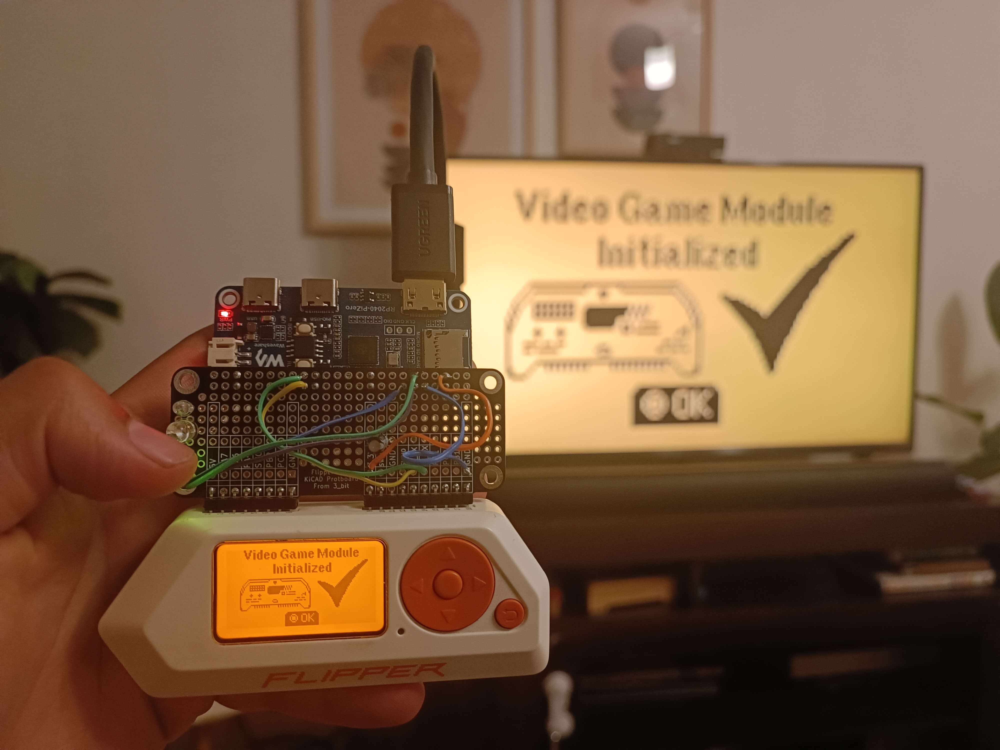
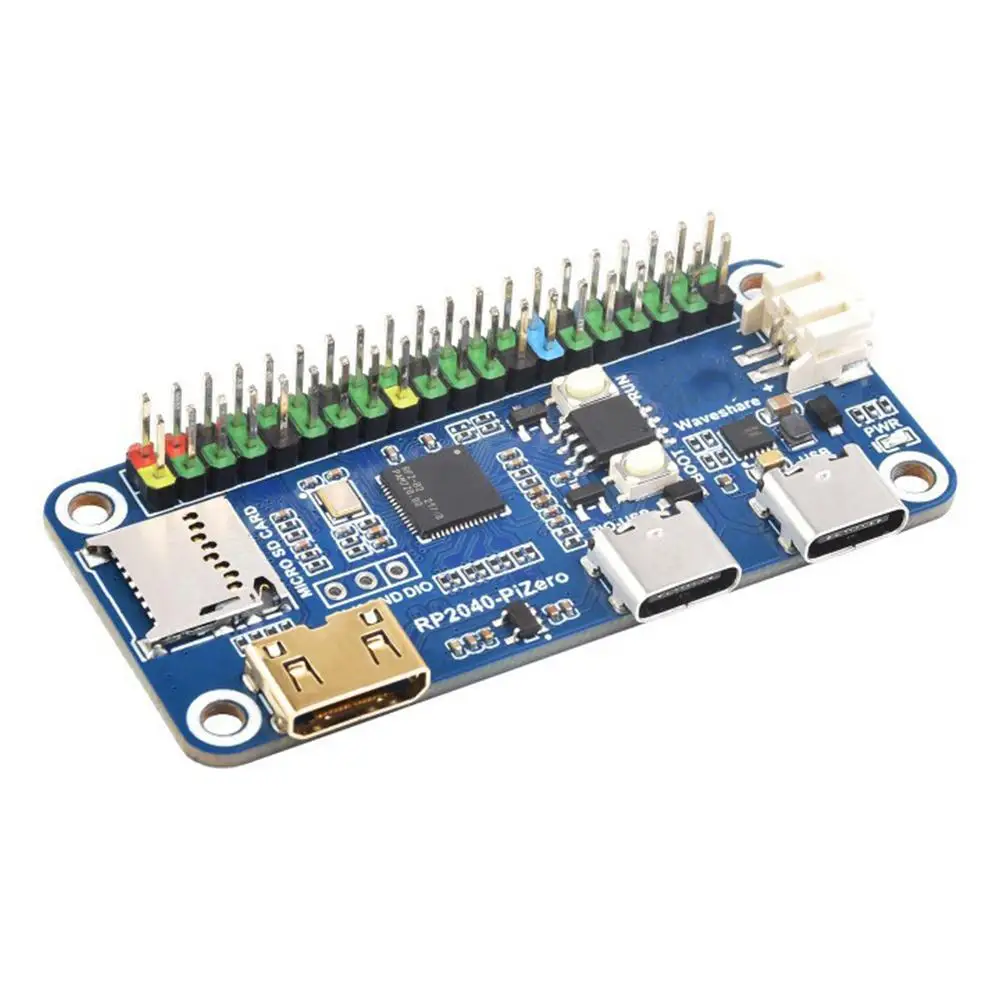
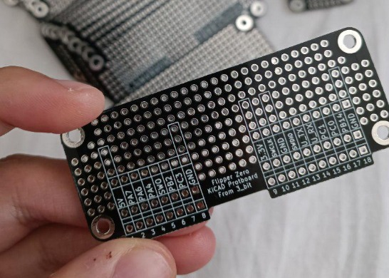
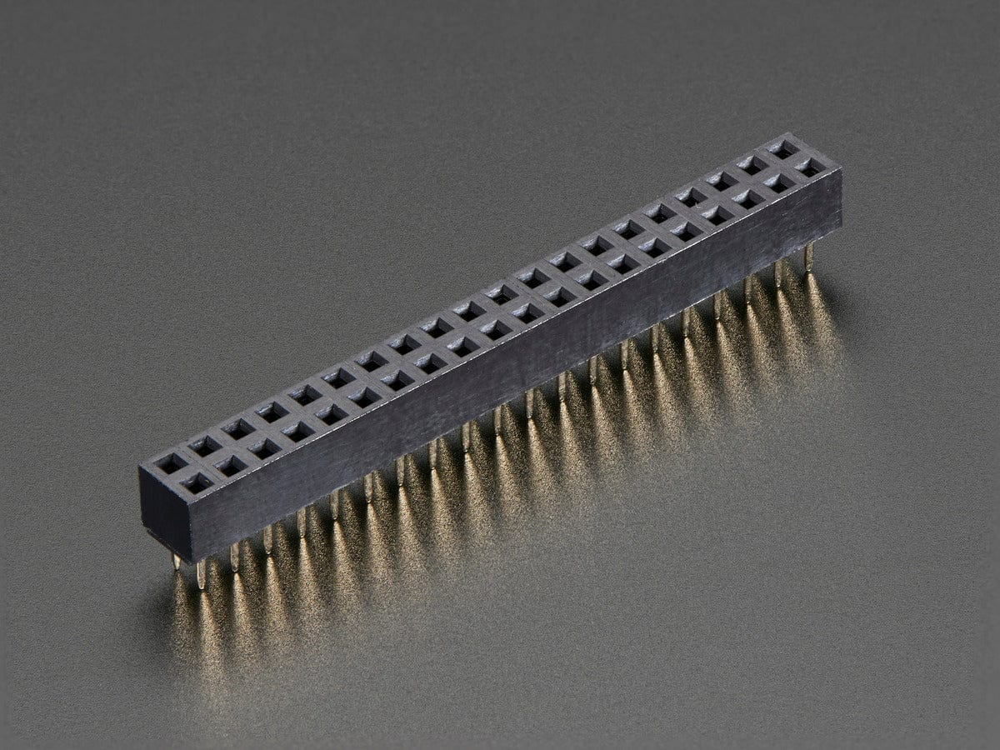
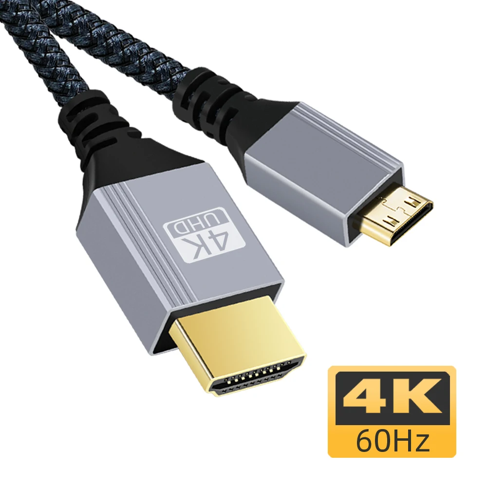

# Flipper Zero - DIY Video Game Module (Powered by Raspberry Pi)

https://www.youtube.com/watch?v=03s6hPvNI-c

## Building

Requirements: 

- arm-none-eabi-gcc
- CMake
- Protobuf

## Buy

| Image  |  Product |
|---|---|
|   | [RP2040-PiZero](https://s.click.aliexpress.com/e/_DkA131b)  |
|   | [Flipper Zero Protoboard](https://www.pcbway.com/project/shareproject/Flipper_Zero_Protoboard_31f89159.html)  |
|   | [1X40P 90 Degree Right Angle Single Row Male Pin Header **REVERSE**](https://s.click.aliexpress.com/e/_Dm2ZEMN)  |
|  | [Breadboard Jumper Wire](https://s.click.aliexpress.com/e/_DBAkVO9)  |
|   | [2x20 Pin Header (optional)](https://s.click.aliexpress.com/e/_DFUpfQl) |
|   | [Capacitor 25V10UF](https://s.click.aliexpress.com/e/_DCMb1JX)  |
|   | [Mini HDMI to HDMI Cable Adapter (optional)](https://s.click.aliexpress.com/e/_DeoZp3B) |

## Connections

| Flipper Zero Protoboard | RP2040-PiZero |
|-------------------------|---------------|
| 3.3V                    | 3V3           |
| GND                     | GND           |
| RX                      | GP0           |
| TX                      | GP1           |
| Led Blue (optional)                | GP5           |
| Led Red  (optional)               | GP4           |
| Led Green (optional)              | GP14          |

_Connect the positive terminal of the Capacitor to the 3.3V rail of the protoboard and the negative terminal to GND._

## Getting Source Code

	git clone --recursive https://github.com/EstebanFuentealba/Flipper-Zero-Video-Game-Module-DIY.git

Make sure that all git sub-modules was recursively cloned.

## Compiling

	# In project folder
	( cd build && cmake .. && make )

Compiled firmware can be found in `app` folder.

**NOTE**: If you are unable to compile, you can also download the pre-compiled file from the [**Releases**](https://github.com/EstebanFuentealba/Flipper-Zero-Video-Game-Module-DIY/releases)

## Flashing

- Press and hold boot button, plug VGM into your computer USB
- Copy [`vgm-fw-diy.uf2`](https://github.com/EstebanFuentealba/Flipper-Zero-Video-Game-Module-DIY/releases) from `build/app` folder to newly appeared drive
	- In MacOS `cp -X build/app/vgm-fw-diy.uf2 /Volumes/RPI-RP2 `

# Extra: RP2040-PiZero-Schematic
https://files.waveshare.com/wiki/RP2040-PiZero/RP2040-PiZero-Schematic.pdf
